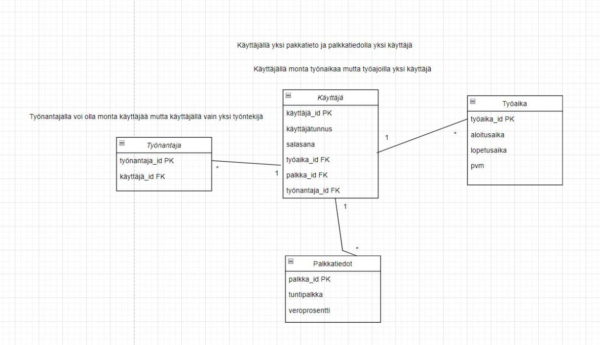

# Tuntilaskuri

## Projektin alustava kuvaus

Projektin tarkoituksena on luoda sovellus, jolla pystyy laskemaan tehtyjä työtunteja, laskemaan palkkaa sekä tarkastelemaan syötettyjä tietoja niin päivä-, viikko- kuin kuukausitasolla.

Sovelluksessa käyttäjä voi syöttää töiden aloitus- ja lopetusajankohdan sekä laskea tehdyt työtunnit. Työtuntien lisäksi käyttäjä voi laskea suuntaa antavan palkan. Mikäli käyttäjä on rekisteröitynyt sovellukseen pystyy hän tarkastella omia työtunti- ja palkkatietojaan.

Tärkeinä ominaisuuksina ovat: työajan, tuntipalkan ja veroprosentin syöttäminen. Kirjautuneena käyttäjänä voi tarkastella omia syötettyjä tietoja.

## Toteutusteknologiat

Front-end:
- React js

Back-end:
- Spring Boot
- Java
- H2-tietokantaa hyödynnetään alussa testidatan luomiseen
- Thymeleaf datan tallentamisen testaamiseen

## Tekijät

- Atte Mäkinen
- Valtteri Raatikainen 
- Niko Tikkanen
- Jimi Podduikin 
- Laura Waenerberg
  
## Käyttöliittymä
 
Kirjautunut käyttäjä pystyy syöttämään työn alku- ja loppuajan, tuntipalkan ja veroprosentin. Tiedot voidaan tallentaa tietokantaan ja niitä voidaan tarkastella päivä, viikko ja kuukausi tasolla. 
Näkymien välillä voidaan liikkua navigaatiovalikon avulla.
Mikäli käyttäjä ei ole rekisteröitynyt voi hän laskea palkkansa tuntipalkan ja tuntimäärän avulla. Kirjautumaton käyttäjä ei voi tallentaa syöttämiään tietoja, vaan ne häviävät istunnon jälkeen.

Virhe tilanteissa tulee alert viesti. Tämä tapahtuu esimerkiksi tilanteessa jossa käyttäjä syöttää negatiivisen tuntipalkan tai kellonajan.
  
## Kaaviot

### Luokkakaavio

### Relaatiokaavio

## Trello
Linkki Trelloon: https://trello.com/invite/b/c7l1eFMW/ATTI6890ecd76bfd40c4ca2e6502b12c261d1F6CD6F1/oma-trello-tauluni# work-calculator-front
