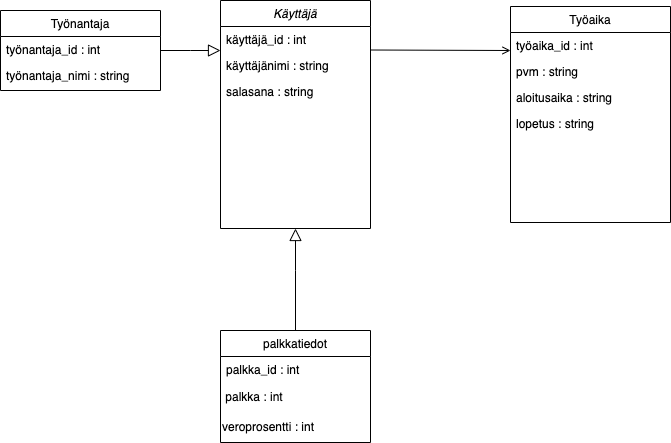

# Tuntilaskuri

Tässä projektissa on tarkoituksena luoda sovellus, jolla pystyy laskemaan tehtyjä työtunteja, laskemaan palkkaa sekä tarkastelemaan syötettyjä tietoja niin päivä-, viikko- kuin kuukausitasolla.

Tärkeinä ominaisuuksina ovat: työajan, tuntipalkan ja veroprosentin syöttäminen. Kirjautuneena käyttäjänä voi tarkastella omia syötettyjä tietoja.

### Toteutusteknologiat
Front-end:
-React 

Back-end:
-Spring Boot.

### Kaaviot

Tekijät: Atte Mäkinen, Valtteri Raatikainen, Niko Tikkanen, Jimi Podduikin ja Laura Waenerberg.

Linkki Trelloon: https://trello.com/invite/b/c7l1eFMW/ATTI6890ecd76bfd40c4ca2e6502b12c261d1F6CD6F1/oma-trello-tauluni# work-calculator-front
